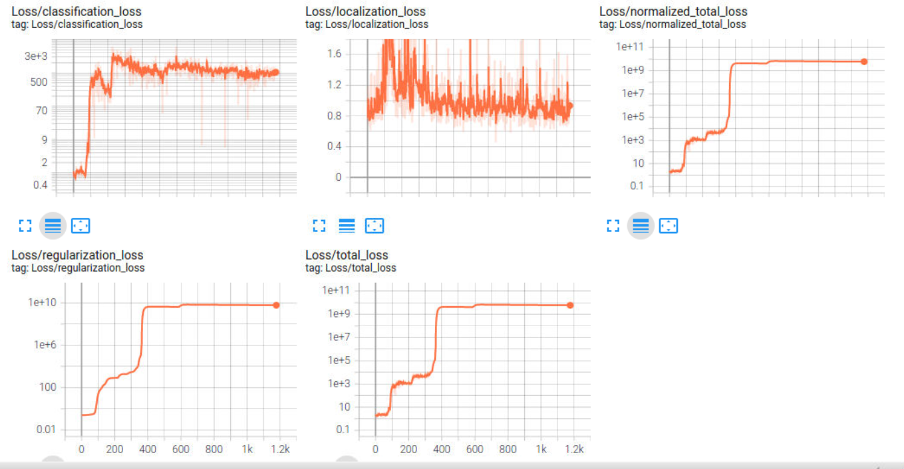
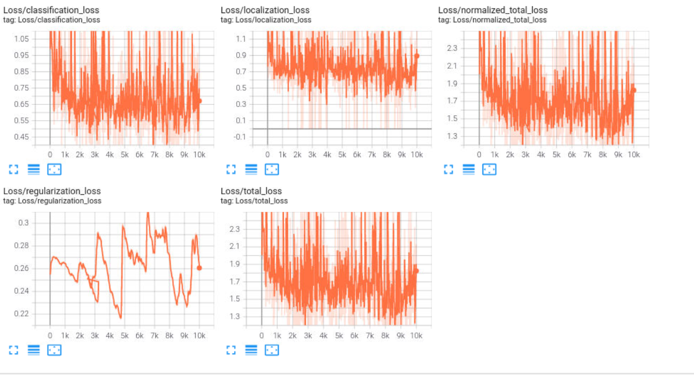

# Project Writeup

## Project overview: 

The github repository of this submissions is  https://github.com/lightblu/nd013-c1-vision-starter (main branch).

### Introduction: For what do we need object detection?

Object detection is a critical component of self-driving car systems because it allows the car to detect and track objects in its environment, such as pedestrians, other vehicles, and obstacles. 
This information is necessary for the car to make real-time decisions about its driving behavior, such as when to accelerate, brake, or change lanes. Without reliable object detection, the car would be unable to operate safely and effectively in complex, dynamic traffic environments.

Object detection is even important for simpler control assist systems in non-self-driving cars that are already out on the streets today. 
For example, it is a critical component of advanced driver assistance systems (ADAS) such as collision warning systems, automatic emergency braking, and lane departure warning systems. 
These systems use sensors such as cameras, radar, and lidar to detect and track objects in the car's environment, which enables the car to take action to avoid or mitigate collisions. 
Object detection is also important for parking assist systems, which use sensors to detect objects and provide guidance to the driver during parking maneuvers. 
Overall, object detection is an essential technology for enhancing the safety and convenience of modern cars, both self-driving and non-self-driving.

Object detection is currently used in cars for a wide range of use cases, including:
1. Collision avoidance: detect obstacles in the car's path, alert driver or activate automatic braking
2. Blind spot monitoring: alert driver if there is a vehicle in the adjacent lane.
3. Pedestrian detection: detect pedestrians in the car's path, alert  driver or activate automatic braking
4. Lane departure warning: alert driver if the car begins to drift out of the lane
5. Traffic sign recognition: recognize traffic signs such as stop signs, speed limit signs, and no-entry signs, and provide alerts
6. Parking assistance: detect obstacles around the car during parking maneuvers and provide guidance
7. Adaptive cruise control: maintain a safe distance to the vehicle in front by adjusting the car's speed.


### Goal of this project

Get acquainted with training neural networks and the toolchain and achieve some object detection of vehicles, pedestrian and cyclists with the provided data set.

## Set up

### Python requirements.txt

The complete [requirements.txt](./build/requirements.txt) has been generated with ```pip freeze``` and can be found in the build folder.

### Basic setup

- Fork and then clone repository from https://github.com/lightblu/nd013-c1-vision-starter

- Beyond this not much is needed as due to lack of a proper GPU, the provided VM workspaces is used, which has most of the data. However, the original build folder with a Dockerfile can be found at: https://github.com/udacity/nd013-c1-vision-starter/tree/main/build

- For step two download pretrained model (262M uncompressed in the end!)

     cd/home/workspace/experiments/pretrained_model/
     wget http://download.tensorflow.org/models/object_detection/tf2/20200711/ssd_resnet50_v1_fpn_640x640_coco17_tpu-8.tar.gz
     tar -xvzf ssd_resnet50_v1_fpn_640x640_coco17_tpu-8.tar.gz
     rm -rf ssd_resnet50_v1_fpn_640x640_coco17_tpu-8.tar.gz

### VM recurring setup

Due to those VMs crashing or being recreated after shutting down, the reguluar routine included:
  
  - Configure git:
  
     git config --global user.email "..."
     git config --global user.name "..."
     git config --global credential.helper 'store --file ~/.git_credentials'

  - Install style checker for pep8 conformity and seaborn and pandas for additional tooling
  
     pip install pycodestyle seaborn pandas
  
  - Install chromium
  
     sudo apt-get update
     sudo apt-get install chromium-browser 
     
Unfortunately, crashing or refreshing VMs became such a common task, that this even needed to go [into its own setup script](./vmsetup.sh). 

### Launch jupyter notebook

As this Firefox version often crashes with jupyter notebook the suggested workaround is to use Chrome. 
Use the adapted [launch_jupyter.sh](./launch_jupyter.sh) to have it start directly with chromium-browser:
  
    jupyter notebook --port 3002 --ip=0.0.0.0 --allow-root --browser="chromium-browser %s --no-sandbox"


## Dataset

### Dataset Analysis: 

The dataset analysis was conducted in [ExploratoryDataAnalysis.ipynb](./ExploratoryDataAnalysis.ipynb).

The dataset consists of various images taken of a car's
frontcam in various situations:
 - day and night times, night time pictures being very dark
 - good and bad weather conditions, wet and foggy conditions partly being very blurry
 - different locations, from rural to city regions

Below you see randomly chosen pictures from training and validation set with their RGB and grayscale histograms:


Multiple of these were looked at. By inspecting they seem to not be biased for specific scenarios. However all these pictures are surely limited in regard to what scenarios they cover, and likely lack a lot. E.g. very different landscapes like the desert, or city and landscapes under snow and icy conditions (much more exist) are likely not represented (or at least not represented in a reasonable number).

From plotting the distribution of objects per picture across the different sets, it also becomes apparent that this dataset has a problem of too few cyclists. The occurences of cyclists are only outliers, but fortunately (depending on viewpoint also unfortunately), cyclists are not represented in the test set at all, so this will not show up in the preceision. Better are pedestrians, with similar concerns here, especially crowded pictures look underpresented.

 
**Distribution of labelled objects across data sets**

### Cross-validation: 

The data came already with a classical provided training vs validation set split at 10%, that also did not seem biased.


**Left: only training vs validation set RIGHT: all three together**


## Training

Training and evaluation are doen with the provided helper script:

    python experiments/model_main_tf2.py --model_dir=experiments/reference/ --pipeline_config_path=experiments/reference/pipeline.config

additionaly one can start the dashboards to visualize results (browse to localhost:6006)

    python -m tensorboard.main --logdir experiments/reference/
    
Evaluation:

    python experiments/model_main_tf2.py --model_dir=experiments/reference/ --pipeline_config_path=experiments/reference/pipeline.config --checkpoint_dir=experiments/reference/

### Reference experiment

A little time was wasted here because of expecting that the pretrained model and the provided pipeline.config as shown in the instructions should yield some successful results, but they all had overly growing loss and only improved for short times:


                     
  
**Loss and learning rate of reference experiment**

The different learning_rate was because of the configured warmup phase. The loss did not stop growing due too overfitting or/and too big stepsize?



Why results in numbers looked differently here could not be figured out, as other problems with VMs shuting down, crashing, or running into a full disk were hard to fight. Due to that also not all data could be kept. 

Evaluations of these runs looked similarly bad and like:

Metric | Value
------ | ------
 Average Precision  (AP) @[ IoU=0.50:0.95 area=   all maxDets=100 ] | 0.000
 Average Precision  (AP) @[ IoU=0.50      area=   all maxDets=100 ] | 0.000
 Average Precision  (AP) @[ IoU=0.75      area=   all maxDets=100 ] | 0.000
 Average Precision  (AP) @[ IoU=0.50:0.95 area= small maxDets=100 ] | 0.000
 Average Precision  (AP) @[ IoU=0.50:0.95 area=medium maxDets=100 ] | 0.000
 Average Precision  (AP) @[ IoU=0.50:0.95 area= large maxDets=100 ] | 0.001
 Average Recall     (AR) @[ IoU=0.50:0.95 area=   all maxDets=  1 ] | 0.000
 Average Recall     (AR) @[ IoU=0.50:0.95 area=   all maxDets= 10 ] | 0.000
 Average Recall     (AR) @[ IoU=0.50:0.95 area=   all maxDets=100 ] | 0.005
 Average Recall     (AR) @[ IoU=0.50:0.95 area= small maxDets=100 ] | 0.000
 Average Recall     (AR) @[ IoU=0.50:0.95 area=medium maxDets=100 ] | 0.000
 Average Recall     (AR) @[ IoU=0.50:0.95 area= large maxDets=100 ] | 0.097
 DetectionBoxes_Precision/mAP: | 0.000033
 DetectionBoxes_Precision/mAP@.50IOU: | 0.000133
 DetectionBoxes_Precision/mAP@.75IOU: | 0.000007
 DetectionBoxes_Precision/mAP (small): | 0.000000
 DetectionBoxes_Precision/mAP (medium): | 0.000000
 DetectionBoxes_Precision/mAP (large): | 0.000541
 DetectionBoxes_Recall/AR@1: | 0.000000
 DetectionBoxes_Recall/AR@10: | 0.000050
 DetectionBoxes_Recall/AR@100: | 0.004821
 DetectionBoxes_Recall/AR@100 (small): | 0.000000
 DetectionBoxes_Recall/AR@100 (medium): | 0.000000
 DetectionBoxes_Recall/AR@100 (large): | 0.096600
 Loss/localization_loss: | 1.095490
 Loss/classification_loss: | 0.815495
 Loss/regularization_loss: | 107.768509
 Loss/total_loss: | 109.679489

 The inflating loss is indication of the model overfitting quite quickly. This will be tried to handle by using augmentations and a different optimzier in the next experiments.

### Improve on the reference: experiment1

Changes:

- Tried to add augmentations that made sense to prevent overfitting too quickly. Tested multiple things within  [ExploreAugmentations.ipynb](./ExploreAugmentations.ipynb).

```
    data_augmentation_options {
           random_rgb_to_gray {
      probability: 0.2
      }
    }
    data_augmentation_options {
           random_black_patches {
      probability: 0.15
      }
    }
    data_augmentation_options {
           random_patch_gaussian {
      }
    }
    data_augmentation_options {
           random_horizontal_flip {
      probability: 0.3
      }
    }
    data_augmentation_options {
           random_vertical_flip {
      probability: 0.02
      }
    }
    data_augmentation_options {
      random_adjust_brightness {
      max_delta: 0.4
      }
    }
    data_augmentation_options {
      random_jitter_boxes {
        ratio: 0.05
      }
    }
```
- The vertical flip is actually very uncommon to happen in reality, still wanted to keep it in with low probability to evaluate its impact and eventually help with overfitting, for which in the end the time did not suffice. At least for the final experiment it did not seem to spoil results.
- Because reference attempts seemed so off to something reasonable, switched also optimizer to 

    ```
    adam_optimizer {
       learning_rate {
        constant_learning_rate {
          learning_rate: 0.0003
         }
       }
    ```




This seemed to go a lot besser, as the loss now did not start to grow anymore, but also did not seem to optimize at all.

### Improve on the reference: experiment2

Because of prior results, switching again to another optimize, and as a suggestion from the forum also tried increasing the batch size a bit:

    train_config {
      batch_size: 6
      ...   
    optimizer {
      momentum_optimizer {
        learning_rate {
          constant_learning_rate {
          learning_rate: 0.005
        }
      }
      momentum_optimizer_value: 0.9
    }
    ...

This seemed to finally perform finally as expected and actually achieve some loss optimization. However, getting it to run longer also deemed to be very challenging as either the VM just crashed/restarted, or ran out of disk. Sometimes the terminal running the training also just disappeared.
 Tried to set checkpoint_every_n to different values to try to not have the training write too many checkpoints so it doesn't run out of space too quickly, but also have enough checkpoints so we don't loose many steps which took hours to compute if it would crash (e.g. above shows 1600 steps per hour, and even without the crashes it took over 6 hours to get to 10000 steps). Still a lot of progress got repeatedly lost, and also tfevents files needed to be pruned. This is one intermediate graph:


It shows optimization progress, and also includes one restart round as can be seen by the loop. An these are the final graph from 2600 til 10000 steps:


It is unfortunate, that the training due to time constraints could
not be conducted further, as the loss seems still to be decreasing and has not reached a plateau yet. However, as mentioned above, til here it took already just for this experiment over 6 hours, and some frustrating losses.

The evaluation for the final model was:

Metric | Value
------ | ------
 Average Precision  (AP) @[ IoU=0.50:0.95 area=   all  maxDets=100 ] | 0.125
 Average Precision  (AP) @[ IoU=0.50      area=   all  maxDets=100 ] | 0.255
 Average Precision  (AP) @[ IoU=0.75      area=   all  maxDets=100 ] | 0.109
 Average Precision  (AP) @[ IoU=0.50:0.95 area= small  maxDets=100 ] | 0.059
 Average Precision  (AP) @[ IoU=0.50:0.95 area=medium  maxDets=100 ] | 0.443
 Average Precision  (AP) @[ IoU=0.50:0.95 area= large  maxDets=100 ] | 0.568
 Average Recall     (AR) @[ IoU=0.50:0.95 area=   all  maxDets=  1 ] | 0.026
 Average Recall     (AR) @[ IoU=0.50:0.95 area=   all  maxDets= 10 ] | 0.128
 Average Recall     (AR) @[ IoU=0.50:0.95 area=   all  maxDets=100 ] | 0.183
 Average Recall     (AR) @[ IoU=0.50:0.95 area= small  maxDets=100 ] | 0.120
 Average Recall     (AR) @[ IoU=0.50:0.95 area=medium  maxDets=100 ] | 0.550
 Average Recall     (AR) @[ IoU=0.50:0.95 area= large  maxDets=100 ] | 0.645
IDetectionBoxes_Precision/mAP: | 0.124874
IDetectionBoxes_Precision/mAP@.50IOU: | 0.255373
IDetectionBoxes_Precision/mAP@.75IOU: | 0.109026
IDetectionBoxes_Precision/mAP (small): | 0.059038
IDetectionBoxes_Precision/mAP (medium): | 0.442636
IDetectionBoxes_Precision/mAP (large): | 0.568222
IDetectionBoxes_Recall/AR@1: | 0.026370
IDetectionBoxes_Recall/AR@10: | 0.127791
IDetectionBoxes_Recall/AR@100: | 0.182860
IDetectionBoxes_Recall/AR@100 (small): | 0.119607
IDetectionBoxes_Recall/AR@100 (medium): | 0.549874
IDetectionBoxes_Recall/AR@100 (large): | 0.645000
ILoss/localization_loss: | 0.385565
ILoss/classification_loss: | 0.249277
ILoss/regularization_loss: | 0.223495
ILoss/total_loss: | 0.858337

### Animating results

Run the scripts as given:

    python experiments/exporter_main_v2.py --input_type image_tensor --pipeline_config_path experiments/experiment2/pipeline.config --trained_checkpoint_dir experiments/experiment2/ --output_directory experiments/experiment2/exported/


    python inference_video.py --labelmap_path label_map.pbtxt --model_path experiments/experiment2/exported/saved_model --tf_record_path data/test/segment-12200383401366682847_2552_140_2572_140_with_camera_labels.tfrecord --config_path experiments/experiment2/pipeline.config --output_path animation.gif


**Truncated animation due to github file size limits**

It is amazing to see a better result than expected from the precision numbers, though it is also apparent that the classifier has its problem with some objects, and especially smaller objects (which the numbers also already said), and as already seen in the data exploration, the test video also lacks other classes.

### Continued: experiment2

It was only late realized that also evaluation plots over time (and not only with a single final point) shall also be created. However, due to the size constraints (dataset, pretrained model and base installation already summing up to 1 gigabyte, tfevent files growing by another 150M every 1000 steps, and checkpoints also taking up 250M), and evaluation not being able to run at the same time due to OOM errors like this


    2023-02-14 14:52:19.641249: W tensorflow/core/framework/op_kernel.cc:1767] OP_REQUIRES failed at cwise_ops_common.h:312 : Resource exhausted: OOM when allocating tensor with shape[3,3,128,128] and type float on /job:localhost/replica:0/task:0/device:GPU:0 by allocator GPU_0_bfc
    2023-02-14 14:52:29.641549: W tensorflow/core/common_runtime/bfc_allocator.cc:431] Allocator (GPU_0_bfc) ran out of memory trying to allocate 1.00MiB (rounded to 1048576)requested by op conv4_block2_3_conv/kernel/Regularizer/Square

Still at least some combined plots from checkpoints 6 to 10 could be achieved:


**Mean average precision, recall, and loss after 13000 steps. Unfortunately the integrated dashboard and the VM browser interface made it somehow impossible to create this graphs with x axis descriptions. The graphs show a range from 8500 - 1300 steps.** 

Also a downsized full animation was recreated:


**Test video animation with detection boxes at 13000 steps.**


